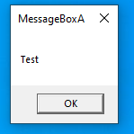
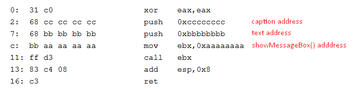
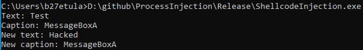
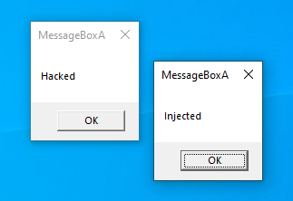

# Process injection techniques
## Shellcode injection
Victim process source code:

It shows messagebox:

VA of caption and text:

As you can see, caption and text are in .rdata section. BaseImage and .rdata section VA:

So, RVA of .rdata is 0x2000, RVA of caption and text is 0x2100 and 0x20F8. Read and rewrite them:

Than create simple shellcode shows the second messagebox with "Injected" text

Correct caption and text addresses in shellcode and add ascii string "Injected" to the end of shellcode

Run it

Result:

## PE injection
bla bla
## DLL injection
bla bla 
