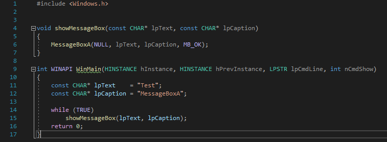
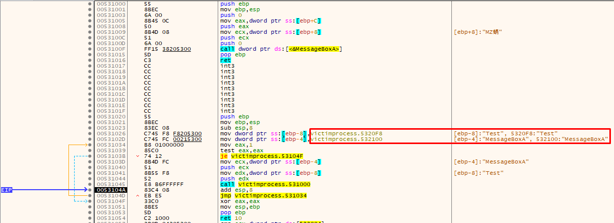
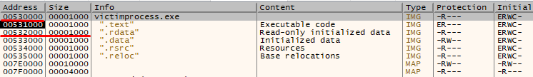
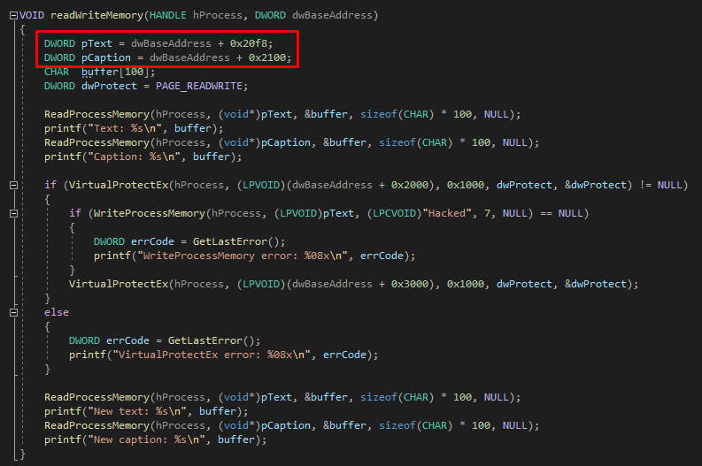
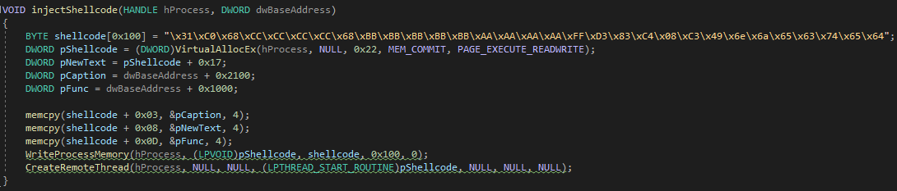

# Process injection techniques
## Shellcode injection
Reading and writing some data from/to process and inject simple code shows messagebox with "Injected" text.

## PE injection
bla bla

## DLL injection
bla bla 
