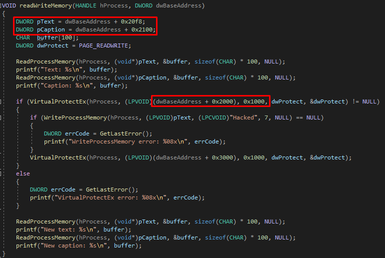

# Process injection techniques
## Shellcode injection
Victim process source code:

It shows messagebox:

VA of caption and text:

BaseImage and .rdata section VA:

So, RVA of caption and text is 0x2100 and 0x20F8. Read and rewrite them:

## PE injection
bla bla
## DLL injection
bla bla 
